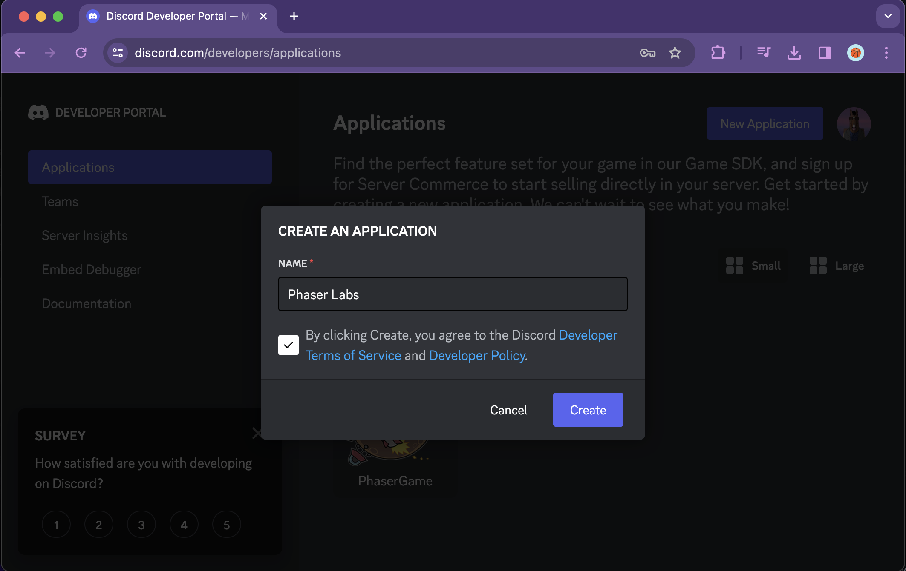
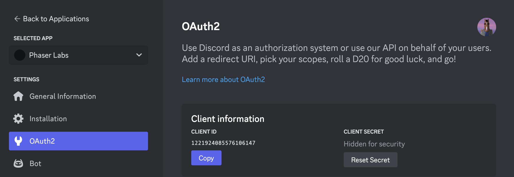
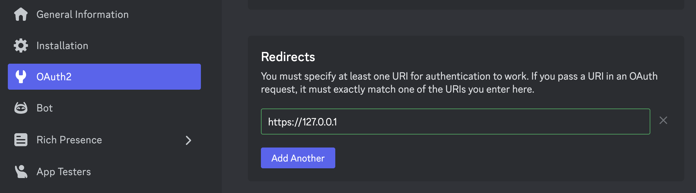
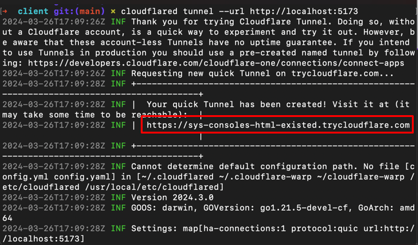
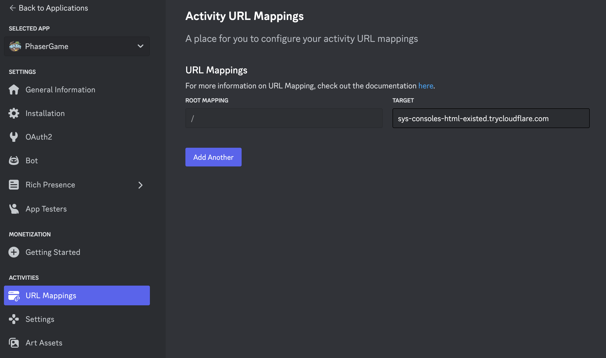
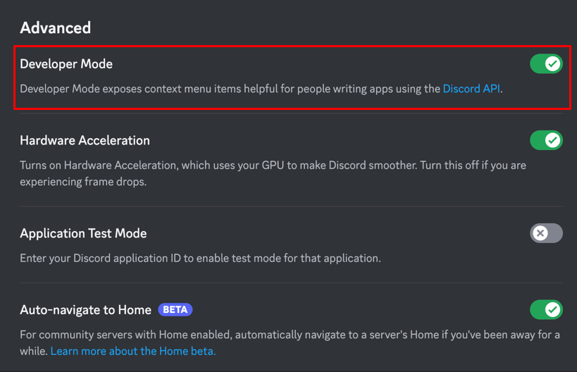
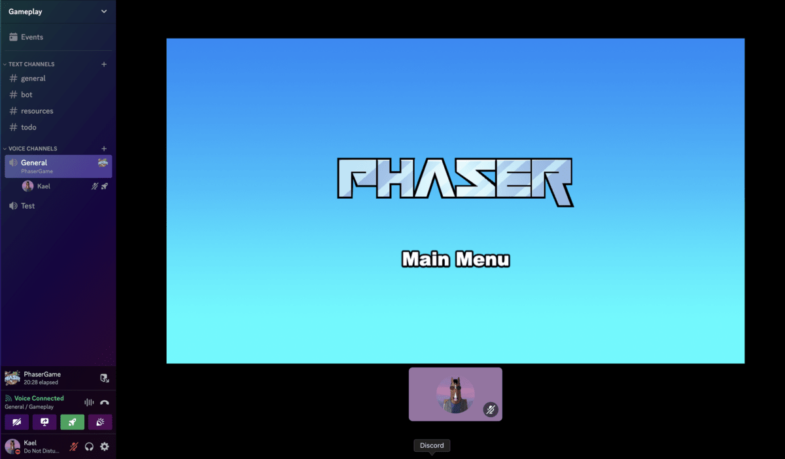
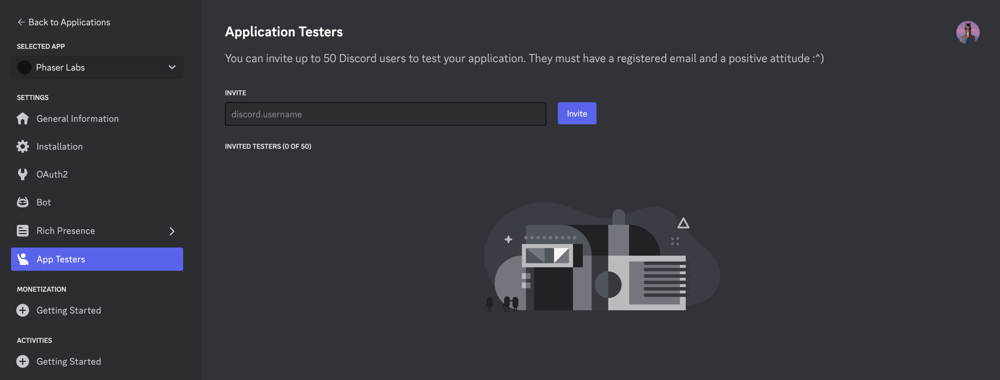

# Creating Discord Game with Phaser

This Project Template is a great starting point for creating games on Discord with Phaser, utilising their new Embedded App SDK. It helps you seamlessly integrate custom games and activities into your Discord server, fostering community engagement, interaction, and fun.

Our template closely follows the structure set-out in the official Discord [Building An Activity](https://discord.com/developers/docs/activities/building-an-activity) Developer Documentation. Follow along with the official documentation when you need more detailed information.

You can get a full overview of the [Discord Embedded App SDK](https://discord.com/developers/docs/activities/overview) on the Discord Developer Portal.

- [Creating Discord Game with Phaser](#creating-discord-game-with-phaser)
  - [Requirements](#requirements)
  - [Creating A Discord App](#creating-a-discord-app)
  - [Installation](#installation)
    - [Set OAuth2 Credentials](#set-oauth2-credentials)
    - [Client Installation](#client-installation)
      - [Initialize the Embedded App SDK](#initialize-the-embedded-app-sdk)
      - [Running the game locally in Discord](#running-the-game-locally-in-discord)
      - [OAuth2 Server](#oauth2-server)
      - [Activate Developer Mode in Discord](#activate-developer-mode-in-discord)
      - [Launch your Activity!](#launch-your-activity)
  - [Test With Other People](#test-with-other-people)
  - [Have Fun!](#have-fun)
  - [Template Project Structure](#template-project-structure)
  - [Handling Assets](#handling-assets)
  - [Customizing the Template](#customizing-the-template)
    - [Vite](#vite)
  - [Join the Phaser Community!](#join-the-phaser-community)

## Requirements

[Node.js](https://nodejs.org) is required to install dependencies and run scripts via `npm`.

## Creating A Discord App

First you need to create a Discord app via the [Discord Developer Portal](https://discord.com/developers/applications):



This app will house your game and allow you to create activities for your server.

## Installation

To get started, clone the Phaser Discord Project Template:

```
git clone git@github.com:phaserjs/discord-template.git
```

Or download it using GitHub Desktop, or a similar GUI, from the [main repository](https://github.com/phaserjs/discord-template)

### Set OAuth2 Credentials

Once cloned you need to set your OAuth2 credentials in the `.env` file.

To do this, rename `example.env` to `.env`. Be careful to not include a double extension, this is a dot-file.

On Linux/MacOS you can do this via the terminal with the following command:

```bash
mv example.env .env
```

On Windows you can do this via the command prompt with the following command:

```bash
move example.env .env
```

Once you have renamed the file, open it in your text editor of choice and replace the placeholders with your OAuth2 credentials, as given on the Discord App -> OAuth2 page:

```
VITE_DISCORD_CLIENT_ID=YOUR_OAUTH2_CLIENT_ID_HERE
DISCORD_CLIENT_SECRET=YOUR_OAUTH2_CLIENT_SECRET_HERE
```



*Prefixing the `DISCORD_CLIENT_ID` environment variable with `VITE_` makes it accessible to our client-side code. This security measure ensures that only the variables you intend to be accessible in the browser are available, and all other environment variables remain private. Read more in the [Vite docs](https://vitejs.dev/guide/env-and-mode)*

Also, don't forget to set **Redirect** URI as https://127.0.0.1



### Client Installation

With the environment set, you can now run the client in the browser:

```bash
cd client
npm install
npm run dev
```

This will start the Vite development server and open your default browser to the game. It will be served from http://localhost:5173

If everything is set up correctly, you should see a Phaser game running in the browser. Feel free to play with it however you like!

#### Initialize the Embedded App SDK

If you look in the `client/package.json` file you will see that the Embedded App SDK is already installed.

To use it, we need to instantiate the **Embedded App SDK** for the client. To do that, you need to **uncomment** the SDK code in the `client/main.js` file:

```js
const discordSdk = new DiscordSDK(import.meta.env.VITE_DISCORD_CLIENT_ID);

setupDiscordSdk().then(() => {
  console.log("Discord SDK is ready");
});

async function setupDiscordSdk() {
  await discordSdk.ready();
} 
```

Doing this will initialize the SDK and make it ready for use in your game. However, as a side-effect it means you will **no longer** be able to view your game directly from your web browser, but will need to test it from within the Discord app itself.

#### Running the game locally in Discord

To run the game locally in Discord, you need to tunnel your local server to a public URL.

We recommend using [cloudflared](https://github.com/cloudflare/cloudflared) or [ngrok](https://ngrok.com/) for this purpose. In this example, we will use **cloudflared**.

If you haven't, you can install cloudflared locally or globally by using: 

```bash
npm i -g cloudflared
```

Then, you can run the following command to tunnel your local server:

```bash
cloudflared tunnel --url http://localhost:5173
```

If all goes well, you should see a message like this:



Note the part we have highlighted in the screenshot above. This is the public URL that your local server is available from. Take a copy of it.

Let's add this public URL to your Discord **Activities -> URL Mappings** admin page, as in the screenshot below:



This completes the loop between your local server and the Discord app, allowing you to test your game in Discord.

#### OAuth2 Server

In order to have OAuth2 working for authorization with Discord, let's install and run our local server. Open a new terminal and run the following commands:

```bash
cd server
npm install
npm run dev
```

This will start the OAuth2 server which will handle the OAuth2 authorization flow with Discord.

#### Activate Developer Mode in Discord

For the final step, we need to activate Developer Mode inside of Discord, so we can view our game in the Activities section.

To do this, go to **Discord Settings -> Advanced -> Developer Mode** and ensure to toggle the control on.



#### Launch your Activity!

Now for the fun part! Go into Discord, select a Voice Channel and click the green 'Activity' icon to launch your game. Make sure you have allowed the channel to create Activities.


If everything has been set-up correctly, you will see your game pop-up in the Activities section.



## Test With Other People

If you want to test your game with other friends on Discord, you need to invite them to test the app. You do this by going to:

**Developer Portal -> Applications -> Your App -> App Testers -> Invite**

Once they accept the invitation, they can join your Activity:



## Have Fun!

This complets the process of getting started creating games on Discord with Phaser. We hope you have fun creating your game and engaging with your community. At the time of writing this Discord feature is still in Developer Preview, which means there are some limitations in place, with regard to how large the server can be and so on. Please refer to the official Discord documentation for the most up-to-date information.

The rest of this document is a guide to the template project structure and how to customize it.

## Template Project Structure

We have provided a default project structure to get you started. This is as follows:

- `client` - Contains the game & Discord SDK source code.
- `client/main.js` - The main entry point for the client. This contains the game & Discord SDK configuration which starts the game.
- `client/scenes/` - The Phaser Scenes are in this folder.
- `client/assets/` - Contains game assets(sprites, sounds, spritesheets, etc).
- `server/server.js` - Contains Discord SDK for OAuth2 connection

## Handling Assets

Vite supports loading assets via JavaScript module `import` statements.

This template provides support for both embedding assets and also loading them from a static folder. To embed an asset, you can import it at the top of the JavaScript file you are using it in:

```js
import logoImg from './assets/logo.png'
```

To load static files such as audio files, videos, etc place them into the `client/assets` folder. Then you can use this path in the Loader calls within Phaser:

```js
preload ()
{
    //  This is an example of an imported bundled image.
    //  Remember to import it at the top of this file
    this.load.image('logo', logoImg);

    //  This is an example of loading a static image
    //  from the public/assets folder:
    this.load.image('background', 'assets/bg.png');
}
```

When you issue the `npm run build` command, all static assets are automatically copied to the `dist/assets` folder.

## Customizing the Template

### Vite

If you want to customize your build, such as adding plugin (i.e. for loading CSS or fonts), you can modify the `client/vite.config.js` file for cross-project changes, or you can modify and/or create new configuration files and target them in specific npm tasks inside of `package.json`. Please see the [Vite documentation](https://vitejs.dev/) for more information.

## Join the Phaser Community!

We love to see what developers like you create with Phaser! It really motivates us to keep improving. So please join our community and show-off your work 😄

**Visit:** The [Phaser website](https://phaser.io) and follow on [Phaser Twitter](https://twitter.com/phaser_)<br />
**Play:** Some of the amazing games [#madewithphaser](https://twitter.com/search?q=%23madewithphaser&src=typed_query&f=live)<br />
**Learn:** [API Docs](https://newdocs.phaser.io), [Support Forum](https://phaser.discourse.group/) and [StackOverflow](https://stackoverflow.com/questions/tagged/phaser-framework)<br />
**Discord:** Join us on [Discord](https://discord.gg/phaser)<br />
**Code:** 2000+ [Examples](https://labs.phaser.io)<br />
**Read:** The [Phaser World](https://phaser.io/community/newsletter) Newsletter<br />

Created by [Phaser Studio](mailto:support@phaser.io). Powered by coffee, anime, pixels and love.

The Phaser logo and characters are &copy; 2011 - 2024 Phaser Studio Inc.

All rights reserved.
