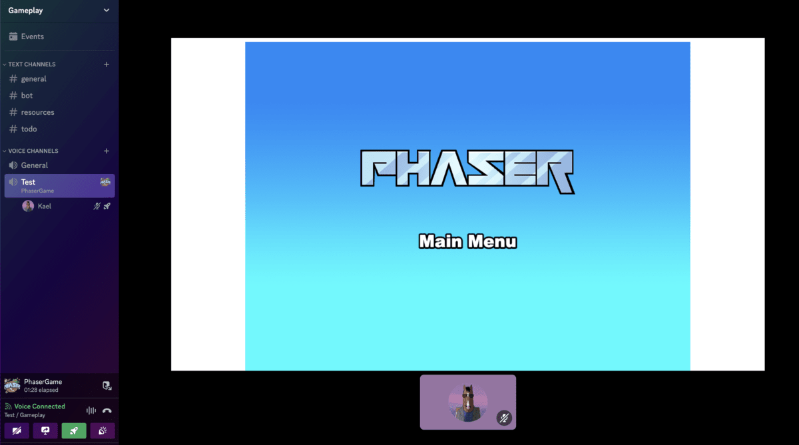

# Phaser Discord Template
This is a Discord Activity template serves as the starting point for creating Discord Activities with Phaser, to help you seamlessly integrate custom games and activities into your Discord server, fostering community engagement, interaction, and fun.

This template is used in the [Building An Activity](https://discord.com/developers/docs/activities/building-an-activity) tutorial in the Discord Developer Docs. You can also follow this guide.

[Read more](https://discord.com/developers/docs/activities/overview) about building Discord Activities with the Embedded App SDK.

- [Creating A Discord App](#creating-a-discord-app)
- [Installation](#installation)
  - [Set OAuth2 Credentials](#set-oauth2-credentials)
  - [Client Installation](#client)
  - [Initialize Embedded App SDK](#initialize-embedded-app-sdk)
  - [Running your app locally in Discord](#running-the-game-locally-in-discord)
  - [Server Installation](#server)
  - [Activate Developer Mode in Discord](#activate-developer-mode-in-discord)
  - [Launch Your Activity!](#launch-your-activity)
- [Test With Other People](#test-with-other-people)
- [Template Project Structure](#template-project-structure)
- [Handling Assets](#handling-assets)



## Requirements

[Node.js](https://nodejs.org) is required to install dependencies and run scripts via `npm`.

## Creating A Discord App
Firstly, let's create our Discord app from [Developer Portal](https://discord.com/developers/applications)


## Installation
Let's clone the project.
```
git clone git@github.com:phaserjs/discord-template.git
```

##### Set OAuth2 Credentials:
Rename **example.env** to **.env** 
```
mv example.env .env // For Linux/MacOS
move example.env .env // For Windows
```

Replace your environment variables in **.env** from **Discord App -> OAuth2**
```
VITE_DISCORD_CLIENT_ID=YOUR_OAUTH2_CLIENT_ID_HERE
DISCORD_CLIENT_SECRET=YOUR_OAUTH2_CLIENT_SECRET_HERE
```


*Prefixing the DISCORD_CLIENT_ID environment variable with VITE_ makes it accessible to our client-side code. This security measure ensures that only the variables you intend to be accessible in the browser are available, and all other environment variables remain private. Read more in the [Vite docs](https://vitejs.dev/guide/env-and-mode)*

Also, don't forget to set **Redirect** URI as https://127.0.0.1.


#### Client:
Let's install & run our client in the browser. Once we run it, it will be served at http://localhost:5173.
```
cd client
npm install
npm run dev
```

Now you can see your Phaser game in the browser, and play with it however you like! 

#### Initialize Embedded App SDK

You will see we already have Embedded App SDK installed in **client/package.json**.
We just need to instantiate **Embedded App SDK** for the client. To do that, you need to **uncomment** SDK code in **client/main.js**:
```js
const discordSdk = new DiscordSDK(import.meta.env.VITE_DISCORD_CLIENT_ID);
setupDiscordSdk().then(() => {
  console.log("Discord SDK is ready");
});
async function setupDiscordSdk() {
  await discordSdk.ready();
} 
```

Once you add the SDK to your app, you will **NOT** be able to view your app inside your web browser. 

#### Running the game locally in Discord
Let's have another terminal tab for network tunnel to run application locally via **cloudflared** or **ngrok**. We will use cloudflared in this example.
If you haven't, you can install cloudflared locally or globally(**npm i -g cloudflared**).
```
cloudflared tunnel --url http://localhost:5173
```


Now, let's add the generated public URL to your Discord **Activities -> URL Mappings**.


#### Server:
In order to have OAuth2 working for authorization with Discord, let's install and run our local server.
```
cd server
npm install
npm run dev
```


#### Activate Developer Mode in Discord
As the last step, we need to activate Developer Mode inside of the Discord, so we can view the our game in the Activities. Go to, **Discord Settings -> Advanced -> Developer Mode -> On**.


#### Launch your Activity!
Now, you can run your Phaser app locally by just creating Activity in Discord! You will see the game will pop up there!


## Test With Other People
You need to add your friends on **Developer Portal -> Applications -> Your App -> App Testers -> Invite**. Once they accept invite, they can join to your Activity.


## Template Project Structure

We have provided a default project structure to get you started. This is as follows:

- `client` - Contains the game & Discord SDK source code.
- `client/main.js` - The main entry point for the client. This contains the game & Discord SDK configuration which starts the game.
- `client/scenes/` - The Phaser Scenes are in this folder.
- `client/assets/` - Contains game assets(sprites, sounds, spritesheets, etc).
- `server/server.js` - Contains Discord SDK for OAuth2 connection

## Handling Assets

Vite supports loading assets via JavaScript module `import` statements.

This template provides support for both embedding assets and also loading them from a static folder. To embed an asset, you can import it at the top of the JavaScript file you are using it in:

```js
import logoImg from './assets/logo.png'
```

To load static files such as audio files, videos, etc place them into the `client/assets` folder. Then you can use this path in the Loader calls within Phaser:

```js
preload ()
{
    //  This is an example of an imported bundled image.
    //  Remember to import it at the top of this file
    this.load.image('logo', logoImg);

    //  This is an example of loading a static image
    //  from the public/assets folder:
    this.load.image('background', 'assets/bg.png');
}
```

When you issue the `npm run build` command, all static assets are automatically copied to the `dist/assets` folder.

## Customizing the Template

### Vite

If you want to customize your build, such as adding plugin (i.e. for loading CSS or fonts), you can modify the `client/vite.config.js` file for cross-project changes, or you can modify and/or create new configuration files and target them in specific npm tasks inside of `package.json`. Please see the [Vite documentation](https://vitejs.dev/) for more information.

## Join the Phaser Community!

We love to see what developers like you create with Phaser! It really motivates us to keep improving. So please join our community and show-off your work 😄

**Visit:** The [Phaser website](https://phaser.io) and follow on [Phaser Twitter](https://twitter.com/phaser_)<br />
**Play:** Some of the amazing games [#madewithphaser](https://twitter.com/search?q=%23madewithphaser&src=typed_query&f=live)<br />
**Learn:** [API Docs](https://newdocs.phaser.io), [Support Forum](https://phaser.discourse.group/) and [StackOverflow](https://stackoverflow.com/questions/tagged/phaser-framework)<br />
**Discord:** Join us on [Discord](https://discord.gg/phaser)<br />
**Code:** 2000+ [Examples](https://labs.phaser.io)<br />
**Read:** The [Phaser World](https://phaser.io/community/newsletter) Newsletter<br />

Created by [Phaser Studio](mailto:support@phaser.io). Powered by coffee, anime, pixels and love.

The Phaser logo and characters are &copy; 2011 - 2024 Phaser Studio Inc.

All rights reserved.
